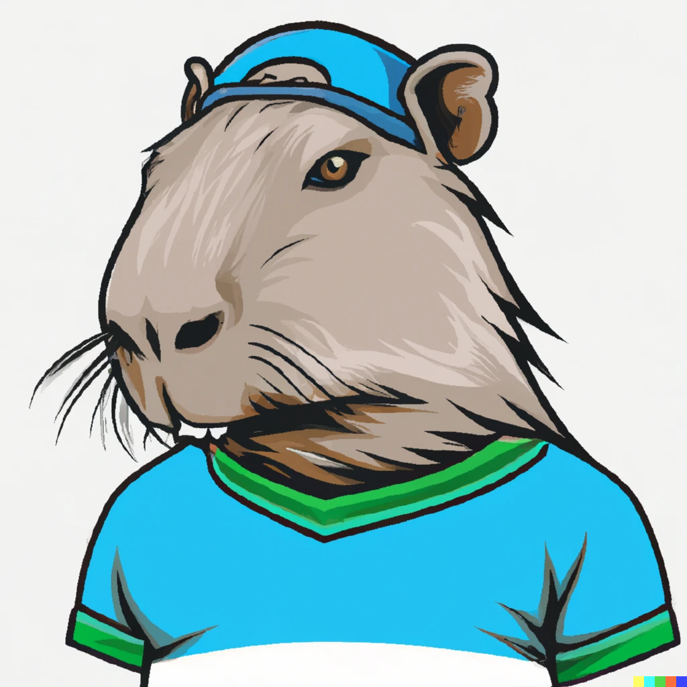

<!---
Hi! We're happy you opened this file, not everyone does!
To let us know you did, paste a capybara picture
in the How to Run section 😊
These will be extra points for you!
-->

> A capybara wearing blue and green clothes, the same as Xtream logo

# React Interview Assignment

## Introduction

This is an interview exercise for the Digital Products team of [xtream](https://www.linkedin.com/company/xtream-srl). In
the following sections, you will find a number of challenges that we ask you to implement. You **DO NOT NECESSARILY need
to complete 100% of them**: you can choose to complete as many as you want.

:watch: We give you **1 week** to submit a solution, so that you can do it at your own pace. We are aware that you might
have other commitments, so we are not expecting you to work on this full-time. You will be evaluated based on the
quality of your work, not on the time you spent on it.

### Deliverables

Simply fork this repository and work on it as if you were working on a real-world project assigned to you. A week from
now, we will assess your work.

### Evaluation

Your work will be assessed according to several criteria. As an example, these include:

* Code quality
* Design Patterns
* Project Structure
* Work quality (commits, branches, workflow, tests, ...)
* Provided Documentation

#### A Friendly Reminder:

We’re all about embracing the latest in AI, including GPT and similar technologies. They’re great tools that can provide
a helping hand, whether it’s for generating ideas, debugging, or refining solutions. However, for this coding challenge,
we’re really keen to see your personal touch. We're interested in your thought process, decision-making, and the
solutions you come up with.

Remember, while using AI tools can be incredibly helpful, the essence of this task is to showcase your skills and
creativity. Plus, be prepared to dive into the details of your code during the technical interview. Understanding the '
why' and 'how' behind your decisions is crucial, as it reflects your ability to critically engage with the technology
you're using.

So, feel free to lean on AI for support, but ensure your work remains distinctly yours. We're looking for a blend of
technical savvy and individual flair. Dive in, get creative, and let’s see what you can create. Excited to see your
work. Happy coding! 🚀💼👩‍💻

### Let's get started

We do understand that some topics might be unfamiliar for you. Therefore, pick any number of challenges and try to
complete them.

:heavy_exclamation_mark:**Important**: you might feel like the tasks are somehow too broad, or the requirements are not
fully elicited. **This is done on purpose**: we want to give you the freedom to make your own choices and to put as
fewer constraints as possible on your work. We appreciate if you could record any decisions, assumptions and doubts,
together with any questions that you will ask in a real-world scenario.

---   

### Problem Domain

Your task is to build the web application for **FreshCart Market**, a simple grocery e-commerce website, where you can
search for products, add to cart, pay for the products and organize the delivery. The client does not want SEO or
other similar features, so it is ok to have a single page application.

For the sake of this assignment, let's focus on creating the **customer** part instead of the **admin** part (which
handles all the products and their available quantities)

Do not consider authentication, sign in or multiple users: for simplicity, imagine the user that is interacting with the
system is always the same.

#### Challenge #1: Available Products

A junior developer started the project and created the list of the products available in the store. The products are
paginated server side but the junior wasn't able to implement the pagination on the frontend. Comment and refactor the
code so that it is more maintainable and reusable while implementing the pagination with infinite scroll.

#### Challenge #2: Categories and Search

There is also a search bar and a list of categories. The user can search for products and filter them by category. The
search will happen when the user types in the search bar and the results will be updated.

#### Challenge #3: Add to cart

On each product there is a button to add it to the cart. The cart is a simple list of products with their quantity and
is handled on the backend. The user can add or remove products from the cart. And the number of products in the cart is
updated in the header and also in the product list. The list is a bit slow to update and the junior developer wasn't
able to fix it. If you end up succeeding on solving this issue, it would be great to provide some proof of the
performance improvements. The add to cart functionality has also a bad user experience because of the slow backend, it
would be great if we can do something on it on frontend Side to make it smother.

#### Challenge #4: Checkout phase

The last part to implement is the checkout phase, where the user can pay for the products and organize the delivery. The
checkout is a multistep form with these steps:

* recap of the cart and final price
* the address where the products should be delivered and the delivery slot selection
* the payment method
* the confirmation of the order

## Documentation

...
